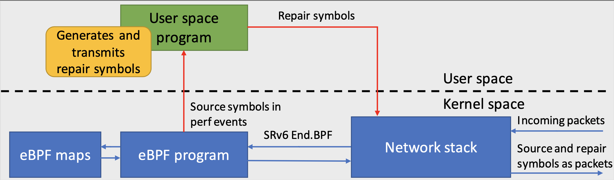

# FEC-SRv6-libbpf

Forward Erasure Correction plugin for IPv6 Segment Routing compiled with libbpf.

## About

This is the work of my master's thesis for the academic year 2020-2021. The objective is to add a Forward Erasure Correction (FEC) plugin to the network layer, leveraging IPv6 Segment Routing (SRv6). We rely on the Linux kernel implementation of SRv6.

An eBPF endpoint has recently been added to the network programmability of SRv6. This endpoint triggers an eBPF program with the SRv6 packet as input (a `struct sk_buff`). We leverage the support of the Linux kernel eBPF virtual machine to add a Forward Erasure Correction plugin in the network layer.

This work has been the opportunity to present a poster to the ACM SIGCOMM'21 titled **SRv6-FEC: Bringing Forward Erasure Correction in IPv6 Segment Routing**.

## Implementation

The plugin is composed of two pluglets: `encoder` and `decoder`. Both have to be installed on network routers, respectively for the encoding and the decoding process of FEC.

Due to the limitations of Linux eBPF, we cannot fully implement FEC as eBPF programs to be injected in the kernel. Consequently, the true architecture of SRv6-FEC is represented in the figure below. The packets are processed and saved in the eBPF program, but the RLC encoding/decoding and the creation of the new packets (redundancy for the encoder, recovered for the decoder) are part of a userspace program. The communications between the userspace and kernel space are the bottleneck performance issues of the program.



## Installation

To use SRv6-FEC, the routers need a 5.4+ kernel version. This works heavily rely on the [libbpf](https://github.com/libbpf/libbpf) project, and must hence respect the compilation conditions.

When this is done, simply go in the [src](src/) folder and execute `make`. This will build two executables, `encoder` and `decoder` that we can run on the routers where we want to add FEC at the network layer. Please take a look at the usage of the two programs to find more information.

By default, you can simply launch on an encoder router the following command:

```./encoder -a -i <encoder-interface>```

This will start the program and attach it to the `<encoder-interface>`. The chosen interface does not have any importance since the End.BPF SRv6 action will redirect every SRv6 packet corresponding to the SID to the program, no matter the interface. By default, the SID is `fc00::a` but can be changed with the correct flag. Also, the default encoding scheme is a Convolutional RLC with a window size of 4 and a window step of 2.

For the decoder, the similar comment applies:

```./decoder -a -i <decoder-interface>```

The default SID for the decoder is `fc00::9`. Please note that if you plan to change the encoder and/or decoder's SID, you will have to add the flags `-d` and `-e` to **both** the encoder and decoder, so that they are able to communicate. For more information, please refer to the poster's abstract.